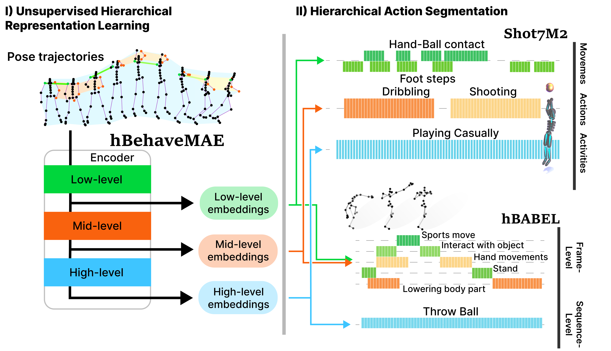

# Official Implementation of h/BehaveMAE and Shot7M2 (ECCV 2024)

> **Elucidating the Hierarchical Nature of Behavior with Masked Autoencoders**<br>
> [Lucas Stoffl](https://people.epfl.ch/lucas.stoffl?lang=en), [Andy Bonnetto](https://people.epfl.ch/andy.bonnetto?lang=en), [Stéphane d'Ascoli](https://sdascoli.github.io/), [Alexander Mathis](https://www.mathislab.org/)<br>École Polytechnique Fédérale de Lausanne (EPFL)
>
> [[ECCV'24](https://www.ecva.net/papers/eccv_2024/papers_ECCV/html/8076_ECCV_2024_paper.php)], [[bioRxiv](https://www.biorxiv.org/content/10.1101/2024.08.06.606796v1)]





## 📰 News
**[2024.10]**  We released the code and datasets for h/BehaveMAE, Shot7M2 and hBABEL🎈<br>
**[2024.07]**  This work is accepted to ECCV 2024 🎉 -- see you in Milano!<br>
**[2024.06]**  h/BehaveMAE and Shot7M2 were presented at [FENS Forum 2024](https://fensforum.org/)<br>


## 🎥 Teaser Presentation
<a href="https://www.youtube.com/watch?v=J8d2jxc5UNo">
  
</a>


## ✨ Highlights

### 🔥 Hierarchical Action Segmentation (HAS) Benchmarks
Recognizing the scarcity of large-scale hierarchical behavioral benchmarks, we create a novel synthetic basketball playing benchmark (Shot7M2). Beyond synthetic data, we extend BABEL into a hierarchical action segmentation benchmark (hBABEL).

### ⚡️ A Generalized and Hierarchical Masked Autoencoder Framework

We developed a masked autoencoder framework (hBehaveMAE) to elucidate the hierarchical nature of motion capture data in an unsupervised fashion. We find that hBehaveMAE learns interpretable latents, where lower encoder levels show a superior ability to represent fine-grained movements, while higher encoder levels capture complex actions and activities.


## 🔨 Installation

We developed and tested our models with `python=3.9.15`, `pytorch=2.0.1`, and `cuda=11.7`. Other versions may also be suitable.
The easiest way to set up the environment is by using the provided `environment.yml` file:

  ```bash
  conda env create -f environment.yml
  conda activate behavemae
  ```

## ➡️ Data Preparation

For downloading and preparing the three benchmarks Shot7M2 ([download here 🏀](https://huggingface.co/datasets/amathislab/SHOT7M2)), hBABEL, and MABe22 we compiled detailed instructions in the [datasets README](datasets/README.md).


## 🔄 Pre-training (code)

To pre-train a model on 2 GPUs:
```
bash scripts/shot7m2/train_hBehaveMAE.sh 2
```

## ⤴️ Inference
To extract hierarchical embeddings after training and evaluate these embeddings:
```
bash scripts/shot7m2/test_hBehaveMAE.sh
```

## 🦁 Model Zoo

We provide a collection of pre-trained models on [zenodo](https://zenodo.org/records/13790191) that were reported in our paper, allowing you to reproduce our results:

|  Method  | Dataset | Checkpoint |
| :------: | :-----: | :--------: |
| hBehaveMAE | Shot7M2 | [checkpoint](https://zenodo.org/records/13790191/files/hBehaveMAE_Shot7M2.pth?download=1) |
| hBehaveMAE | hBABEL | [checkpoint](https://zenodo.org/records/13790191/files/hBehaveMAE_hBABEL.pth?download=1) |
| hBehaveMAE | MABe22 | [checkpoint](https://zenodo.org/records/13790191/files/hBehaveMAE_MABe22.pth?download=1) |


## ✏️ Citation

If you think this project is helpful, please feel free to leave a star⭐️ and cite our paper:

#### 📄 bioRxiv Version
```
@article{stoffl2024elucidating,
  title={Elucidating the Hierarchical Nature of Behavior with Masked Autoencoders},
  author={Stoffl, Lucas and Bonnetto, Andy and d'Ascoli, Stephane and Mathis, Alexander},
  journal={bioRxiv},
  pages={2024--08},
  year={2024},
  publisher={Cold Spring Harbor Laboratory}
}
```
#### 📘 ECCV Version (coming soon)
```
@inproceedings{stoffl2024behavemae,
  title={Elucidating the Hierarchical Nature of Behavior with Masked Autoencoders},
  author={Stoffl, Lucas and Bonnetto, Andy and d'Ascoli, Stéphane and Mathis, Alexander},
  booktitle={European conference on computer vision},
  pages={??},
  year={2024},
  organization={Springer}
}
```

## 👍 Acknowledgements

We thank the authors of the following repositories for their amazing work, on which part of our code is based:
- **[Hiera: A Hierarchical Vision Transformer without the Bells-and-Whistles](https://github.com/facebookresearch/hiera)**
- **[Evaluator code for MABe 2022 Challenge](https://github.com/damaggu/MABe2022)**

## 🔒 Licensing

This repository is licensed under two different licenses depending on the codebase:

- **Apache 2.0 License**: The majority of the project, including all original code and modifications.
- **CC BY-NC 4.0 License**: The code inside the `hierAS-eval/` directory is licensed under the Creative Commons Attribution-NonCommercial 4.0 International License. This means it cannot be used for commercial purposes.

Please refer to the respective `LICENSE` file in the root of the repository and in `hierAS-eval/` for more details.